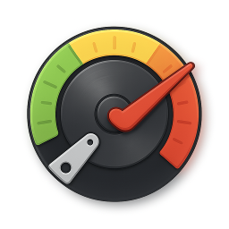
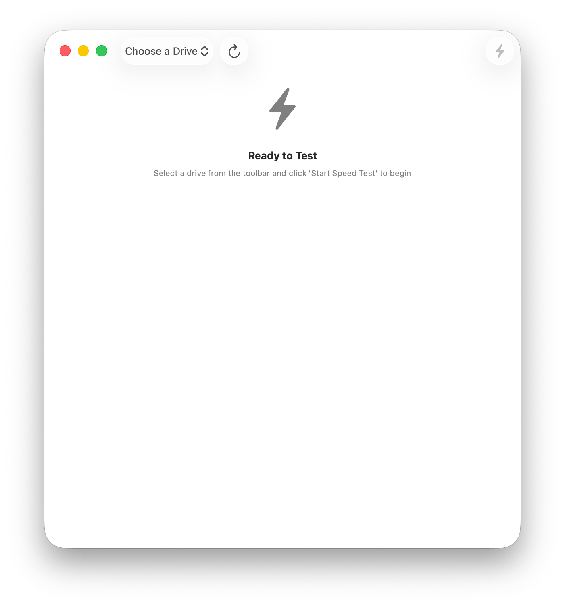
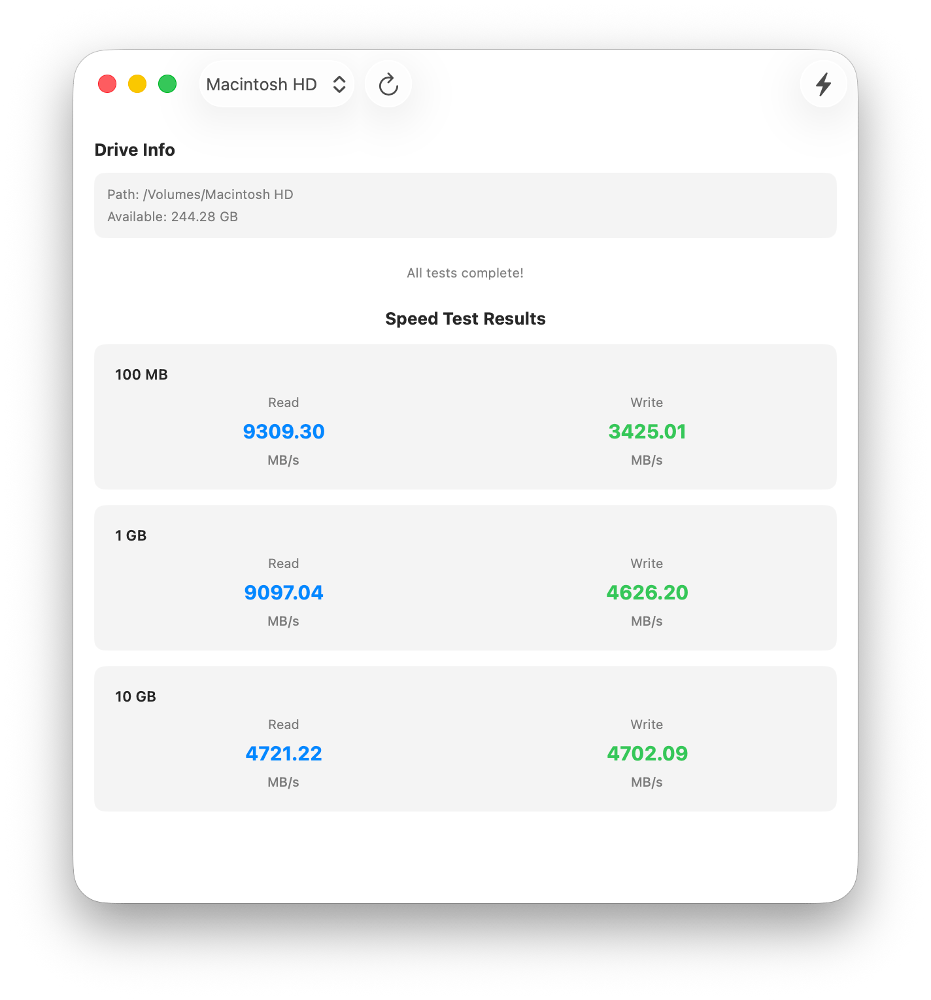

<div align="center">

<picture>
  <source srcset="Documentation/icon-dark.png" media="(prefers-color-scheme: dark)">
  <source srcset="Documentation/icon-light.png" media="(prefers-color-scheme: light)">
  
</picture>
<br/><br/>

<h2>Quick & Simple Disk Speed Test for macOS</h2>
<br><br>

</div>

<p align="center">
    <a href="Documentation/App1.png"></a>
    <a href="Documentation/App2.png"></a>
</p>

A lightweight macOS application for testing disk read and write speeds across different file sizes.

## Features

- **Multi-Size Testing**: Run speed tests with three different file sizes:
  - 100 MB test - Quick baseline measurement
  - 1 GB test - Standard throughput measurement
  - 10 GB test - Large file performance test

- **Comprehensive Metrics**: Each test measures both read and write speeds in MB/s

- **Disk Selection**: Choose from any mounted drive on your system with real-time space availability display

- **Automatic Validation**: Checks for sufficient disk space before running tests (requires 11GB available)

## Usage

1. **Launch the app** - Open Drive Speed from your Applications folder

2. **Select a Drive** - Use the dropdown in the toolbar to choose which drive to test

3. **Check Available Space** - The app displays available disk space; you need at least 11GB to run the full test suite

4. **Start Testing** - Click the "Start Speed Test" button in the toolbar

5. **Wait for Results** - The app will:
   - Test write speed (100MB, 1GB, 10GB files)
   - Test read speed for each file
   - Display results when complete

6. **View Results** - Results appear in the scrollable area below, showing read/write speeds for each test size

## How It Works

### Write Test
- Creates a test file in chunks (8MB at a time)
- Measures sequential write performance
- Synchronizes to disk after completion

### Read Test
- Reads the test file sequentially in chunks (8MB at a time)
- Measures sustained read performance
- Single pass for efficiency

### Why Three File Sizes?
Different file sizes reveal different performance characteristics:
- **100 MB**: Quick test, useful for cached/buffered performance
- **1 GB**: Standard measurement, balances speed vs. test duration
- **10 GB**: Reveals sustained performance without heavy caching

## 🖥️ Install & Minimum Requirements

- macOS 14.0 or later  
- Apple Silicon & Intel (Not tested on Intel)
- ~10 MB free disk space  

### ⚙️ Installation

Download from Releases. It's signed & notarized!

### ⚙️ Build it yourself!

Clone the repo and build with Xcode:

```bash
git clone https://github.com/gbabichev/Drive-Speed.git
```

## 📝 Changelog

### 1.0.0
- Initial Release. 

## 📄 License

MIT — free for personal and commercial use. 